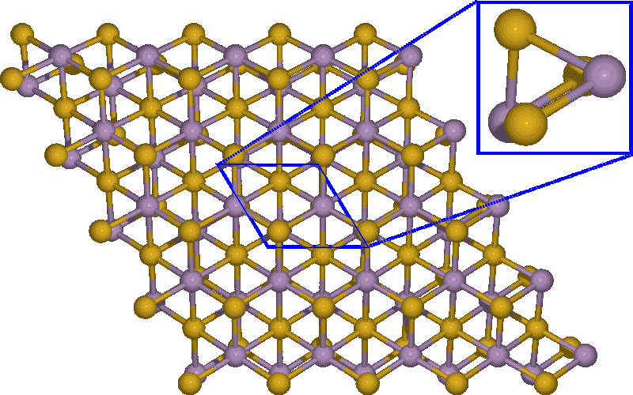

# Figure 1 (Atomic Structure + Band Structure)

This folder documents the files and workflow used to build the composite figure that combines
the atomic structure of monolayer Sb2Te3 with its corresponding electronic band structure.

---

## Purpose

The materials here illustrate how the figure was assembled:

1. **Atomic structure**: a 5×5×1 supercell of Sb₂Te₃, shown with reference axes to indicate the orientation of the applied uniaxial strain.  
2. **Electronic band structure**: data processed and plotted for clarity using Julia/PGFPlotsX.  
3. **Final composition**: both panels combined into a single LaTeX/TikZ layout for a consistent and publication-quality presentation.  

---

## Method

* **Atomic structure**  
  - Generated using the Atomic Simulation Environment (ASE) in Python.  
  - A 5×5×1 supercell was created from the unit cell.  
  - Exported directly from ASE visualization tools.  

* **Band structure**  
  - Numerical data were processed and plotted in Julia using the PGFPlotsX package.  
  - Plots are a direct rendering of calculated eigenvalues — no smoothing or fitting applied.  

* **Final composition**  
  - Structure image and band-structure plots combined in LaTeX with TikZ.  
  - Axes, labels, and annotations (strain direction) added within TikZ.  
  - Ensures consistent fonts, vector quality, and unified layout across subpanels.  

---

## LaTeX workflow

1. **Sb2Te3-sc.tex**  
   Generates a PDF with the structure image rendered in ASE.  
2. **fig_center.tex**  
   Overlays axis references and labels on the structure image.  
3. **fig-1.tex**  
   Combines the processed structure figure with the band-structure plots (with/without SOC, generated via Julia/PGFPlotsX) into the final composite.  

---

## Other figures

Other figures presented in the manuscript are produced using the **plotting scripts** provided in the `scripts-plots/` section of this repository.  
These scripts process the YAMBO and Quantum ESPRESSO outputs and generate publication-quality plots directly from the numerical data.  

---

> :warning: **Important note**  
> These materials represent the author-generated workflow for figure preparation.  
> No generative AI tools were used. All visualizations come from ASE, Julia/PGFPlotsX, and LaTeX/TikZ.  

  

